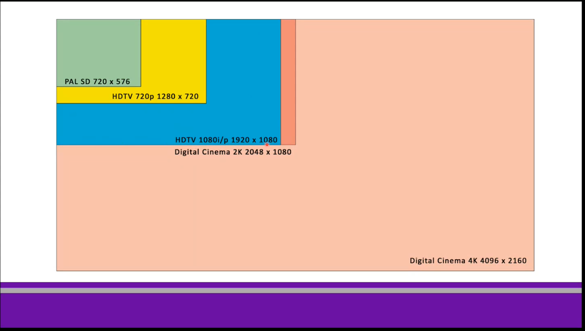
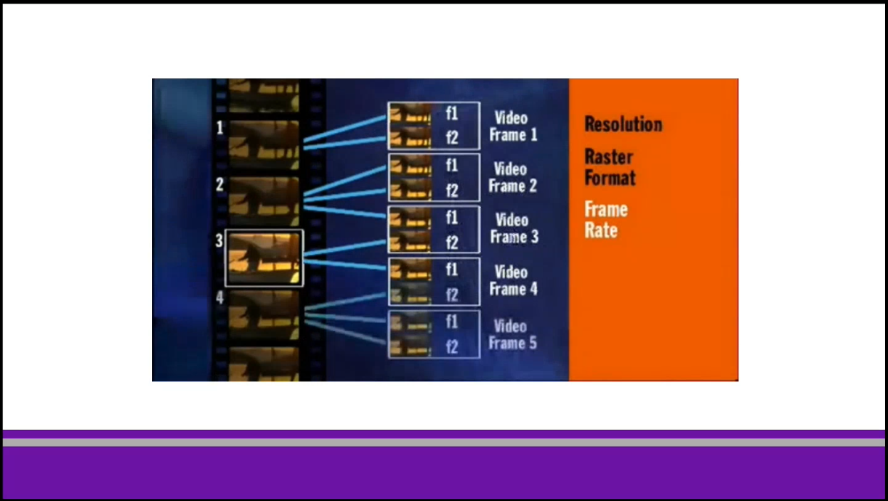

# Lesson-1
---
## What is HD (5 elements)

### Resolution
* 1920 x 1080 (Standard - FULL HD)
* SD 720 x 576 PAL
* HD 1280 x 720
* 2K 2048 x 1080
* 4K (ultra hd) 3840 x 2160
* 4K (digital cineama) 4096 x 2160
* 8K 7680 x 4320 
  (alle measured in px)

### Raster Format
* Every frame is made by a nmber of px that defines the hight and wight of the image
* frames are played 25 times per secod to give the illusion of movement --> **know as progressive**
* Every frame is devided in stripes and combined together --> **known as interlaced** --> used because the data was sent via radio wave, no cables... one picture was too big as data, so a tv used to recieve 50 fields per second (25frames+25frames)

### Frame Rate
* Cinema 24 frames per second (fps)
* Tv 25 fps (slight pitch change from conversion from 24 to 25)
* America Tv 30 fps (conversion done in 2:3 pulldown)

* PAL (Europe) 25fps, NTSC (USA) 29.97 fps, Film 24fps, Soapopera 48/60 fps (smoother feel)

### Aspect Ratio
* relationship between width and height
* Resolution Indipendent
* 4:3 past
* 16:9 Modern HD
* 21:9 Cinemascope (stripes up and down) (Useful for editing)

### Color Space
* Celluloids had a very good texture **Contrast Ratio**
* Analog video had a bad texture
* Nowdays cameras shoot viedeo in RAW, that keeps all the details

## Famous Cameras
* JVC
* Parasonic
* Sony Cinealta
* RED
* ARRI Alexa
* (Thomson Viper)
* Black Magic Design

end
