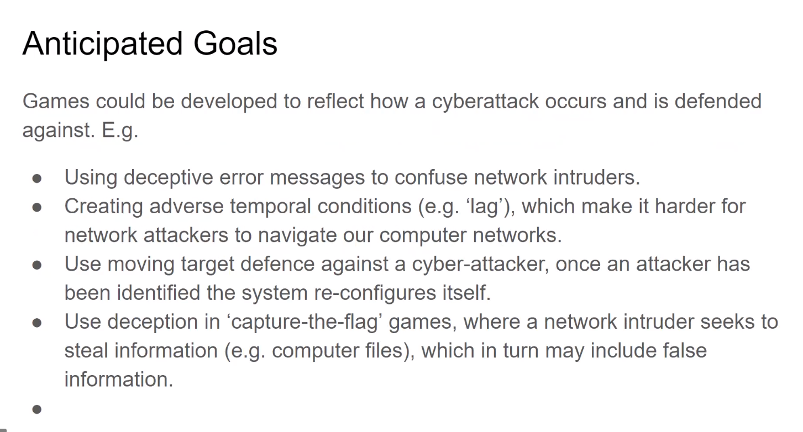
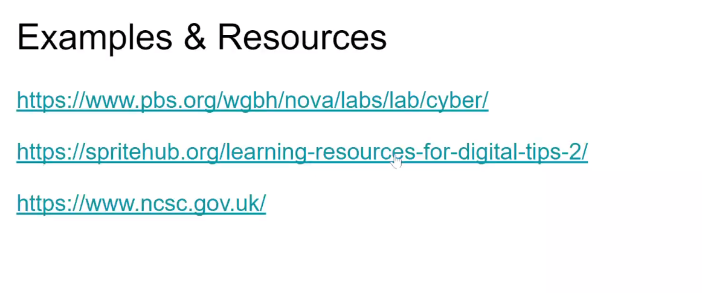

# CYBER SECURITY
---
--?
* You are a White hat haker
* You are in your space station laboratory
* You have multiple coputers
* The computers are constantly attecked by other space ships
* You have to switch between computers
* Play multiple basic minigames to protect your computers
* You have to acumulate points to get powerups
* Power Ups gonna help you to protect your computers
* The game will become more difficult with time
* The attacks will be repedet more often and will have more obstacles
* **The mini games will be something like: fallpy birds, Space invaders and geral arcade classic games**
    

(one click death punch)
(guitar hero)
(point and click)
(app the where you input stuff and they can see their stuff on the website??)

hacker ping pong - protect the PC by deflecting the viruses away from the PC icon with a shield that rotates around the icon, upgrade you'r shield to be faster and stronger.

click bait - minigame where one has to quickly delete the popups before the PC gets a virus

shield builder - this mini game will work similer to pacman one will have to collect all the dots to build a full shield whilst avoiding the ghost viruses

SuS emails - one must check emails and analys them to see which ones could potentionly give the pc a virus

---
# CLIMATE CHANGE
---
--?
enviromental issues
social issues
equality 

20 years sold
ppl not interest in env issues
get more audience
focus not only the disasters but the solutions too

fuer to prime energy

For Individuals to gaining knowledge about:
different factors that contribute to climate change 
(eg. fossil fuel industry, agriculture, food, transport etc.), and
the factors that can mitigate climate change 
(carbon sequestration by forests, oceans, peatlands, moving to green energy etc.)

Climate Justice 
For players to reflect on how climate change impact people around the world differently and the injustices in the impact. 

Offering solutions 
and making players reflect on their impact and what they can do to mitigate it. 

Activism
Making players aware of the importance of activism, giving them the keys to challenge the policies in place : climate strikes and young activists 

Scientific projections & the expected results of doing nothing
Understand what the raise in temperature could mean based on current projections. We are at 1 degree, what would one degree more mean? What would 2 degrees more mean?

5-22 years old
Individuals who are normally not interested in env. topics

WE DON’T WANT TO SEE:

Violence
Post apocalyptic worlds
False solutions
Stereotypes & discriminatory imagery of people, racism, sexism, classism, etc.
WE DO/MIGHT WANT TO SEE:

Positive visions for the future
Solutions
Information pop-ups 

---
# FINANTIAL CAPABILITY
---
--?
* Turn Based strategy game where every move will cost money 
* https://www.udemy.com/user/blackthornprod-2/

ability to manage money is not constant
phases
1. part time to seattle down 18-26 - buy random stuff for pleasure
2. settle down to children "18 to 25 years long"
3. kids fly the nest - before retirement
4. 61 onwards - lower income and profile change

increase awareness on how manage their money
manage money in different life cycles

7 Domains

1. manage budget 
2. manage havings
3. manage debts
4. build safety net
5. pans for the future 
6. understand basic fanancial landscape
7. understanding basic consumet rights

Every person has different challenges (widows, elders)

* **needs and wants**
* **teenagers 10 to 14**
* **get people better and more aware on wants and needs and how they can effects your money**
* **wins who get 80% of spendings are on needs**
* **make sure that you always pay**

---
# BIODIVERSITY
---
--?
* Plants vs Zombies kind of game, With more Enviroments
* Platformer where you have to plant Plants to overcame the obstacles

killer fish
some are going to be extint"""
fishes are getting smaller
due to pollution
in other side of malta their lives are good

(brakish water??) mix of salt and fresh water

they monitor this feesh, breathing, restoking, small scale experients

Project called: killyrfish preservation project

* raise some awareness on this fish
* create an interactive approach on make ppl think about pollution adn climate change
* raise awareness on the conservation of this fish
* 

---