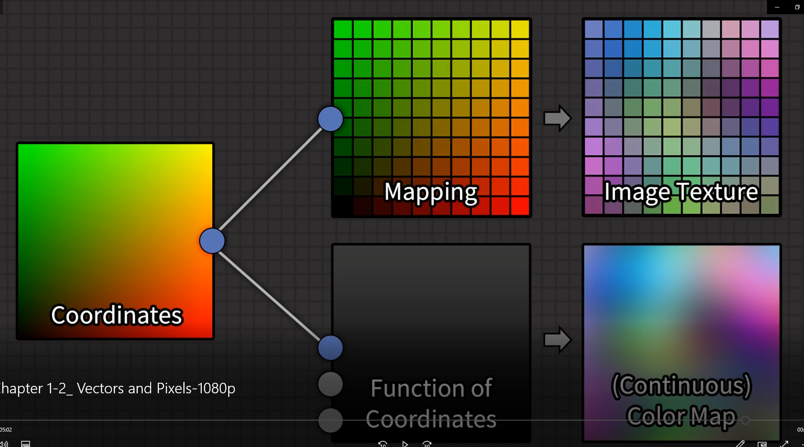

# Procedural Shading Notes

# Colors

### values are nodes in grey

### Colors are nodes in yellow

### Vectors are nodes in Purple

### Shaders are nodes in Green

---

## _Values are_

0 = Black

1 = White

- The color can go below to below 1 but and above 1
- When the color is converted to a value, the three color channels have to be reduced to 1
- The calculated value is the **luminosity Value**
- The Luminosity is a method to the percieved brightness nad is caluclated as a whited avarage of RGB
- If you have to choose a color for a value, choose the same value for all RGB channels
- Use **COMBINE RGB NODE**

---

**Set color management Look to NONE**

**Set filmic to none to have a better understanding just for a little**

---

## _Vectors are_

**containers of multiples separate values**

- it has 3 dimensions (x,y,z)
- it always interpreted as a _position_ or _Direction_
- use **Combine XYZ NODE**
- The values are not clamped from 0 and 1
- NO CONVERSION IS NEEDED
  

---

# Image Textures Node

Static Image Textures are made of Pixels
They have to plugged into an **UV MAP** to have some coordinates

* **UV MAPS goes from 0 to 1 for X and Y values**
* **Red Part goes 0 to 1 to X axis**
* **Green Part goes form 0 to 1 in Y axis**
* Coordinate maps are a continous gradient without steps
* Image texture node take coordinates --> decides withc pixel belongs to that position --> and displys the according color
* Linear softs the pixelation
* Closest increases the pixelation
---
# Procedural Textures Nodes
* Image textures can be created procedurally
* They are matemathical functions
* They are calculated on the spot
* They are done with nodegraphs
* The pixelation depends on the techniques used to create it
* Procedural textures can have any level of detail

---

# Coordinates Types

## Texture Coordinate node

# Generate Coordinates
 * Generate coordinates are anchored to the local bounding box of the object
 * Range from 0 to 1 along each of the 3 axis
 *  **They move with the orientation and location of the object, that means that they scale with the object**
 *  Used when I want that a texture have to appear on the object bounds
  
  # Normal Coordinate node

* Are non coordinates in sense of location
* **Are coordinates in the sense of direction**
* **A normal vector is = to the direction perpendicular to the surface nad has a LENGHT of 1**
    * They use _LOCAL SPACE_, so they are anchored to the object transformation
    * You can get **GLOBAL NORMALS** from the _GEOMETRY INPUT NODE_ Can be found in the **GEOMETRY NODE**
    * They are used to incorporate the object geometruy into a shader
  
  # UV Coordinates
* Are the most conventional way to apply textures
* They stick to the object Geometry, **they are not susceptible to mesh movements**
* UV UNWRAP IS NEEDED, _no shit_
* (Uv unwrap  = transform a 3d object in a 2D space)
* The major benefit is that you can decide the direction and flow of the texture without caring abaut the warping around the mesh

# Object coordinates
* They are centered around the object origin
* They are connected to the object location, rotation and scale
* Is the most common go to for procedural shading
* Used when mesh properties are not needed
* **Mind that object coordinate origins and scale matter**
* Many times is better outsourcing the object coordinates via an empty object, usefl to not change the object main coordinates at all
* As a general guideline, use them with objects that have to scale and stretch
 
 # Camera coordinates
 * Oriented with the the camera view
 * Oriented withe the orientetion of the viewport
 * Commonly used with a **DEPTH PASS** within the shader
 * used for "fake" effects as myst and thngs that have to be stack to the view

# Window Coordinates
* Are two dimensionaal along the X and Y of the Viewport
* They range from 0 to 1
* They scale along with the window
* When in camera view, they are locked to the bounds of the camera
* Commonly used to create Radieal gradients in the world shader
* Works great as a background

# Reflection Coordinates
* Like normals are **NOT coordinates in the sense of location**
* They are coordinate in the sense that **they give informations of the direction of a ray that would be reflected on the surface coming from the viewr**
* Used to generate fake reflections from a specified angle
  
# Position Coordinates
 Can be found in the **GEOMETRY NODE**
* They are anchored to the world (global coordinates)
* Used to create textures that are consistent for multiple objects
* Used to create global effects (dust)

# Geometry node In breaf
(Blender Manual)

(Not highligted = never Used)

Position

Position of the shading point.

Normal

Shading normal at the surface (includes smooth normals and bump mapping).

Tangent

Tangent at the surface.

True Normal

Geometry or flat normal of the surface.

Incoming

Vector pointing towards the point the shading point is being viewed from.

Parametric

Parametric coordinates of the shading point on the surface. To area lights it outputs its UV coordinates in planar mapping and in spherical coordinates to point lights.

Backfacing

1.0 if the face is being viewed from the back side, 0.0 for the front side.

**Pointiness** Cycles Only

**Useful to get EDGE WEAR masks**

An approximation of the curvature of the mesh per vertex. L**ighter values indicate convex angles, darker values indicate concave angles.** It allows you to do effects like dirt maps and wear-off effects.

**Random per Island** Cycles Only

A random value for each connected component (island) of the mesh. It is useful to add variations to meshes composed of separated units like tree leaves, wood planks, or curves of multiple splines.

